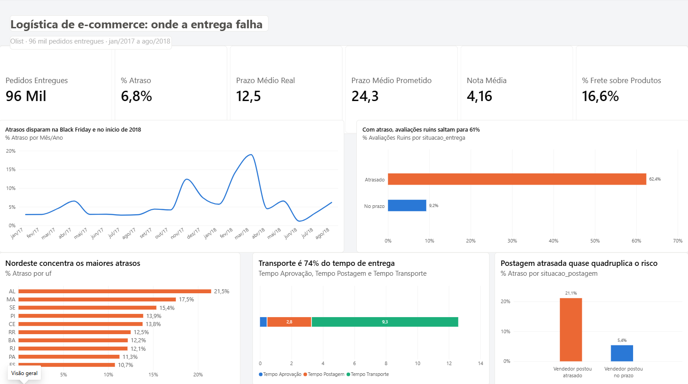
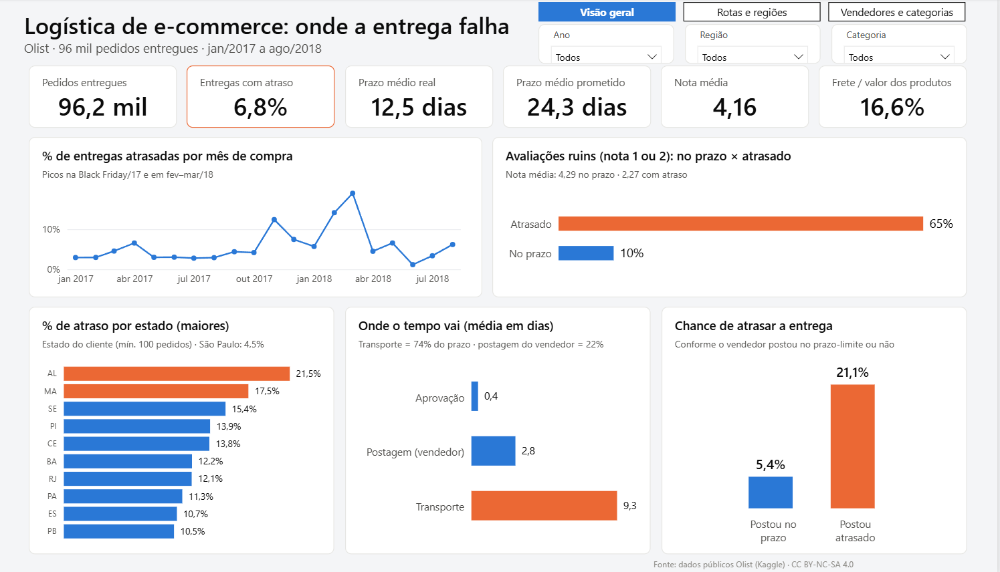
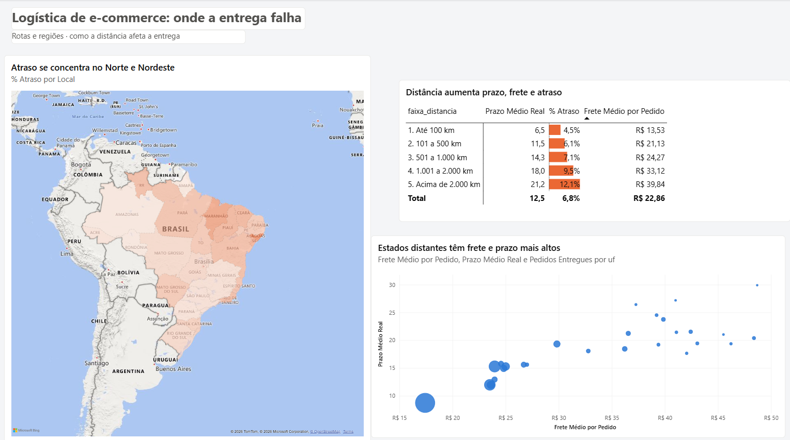
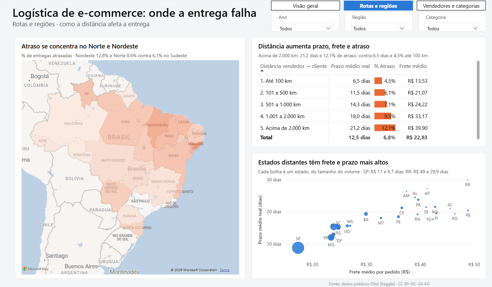
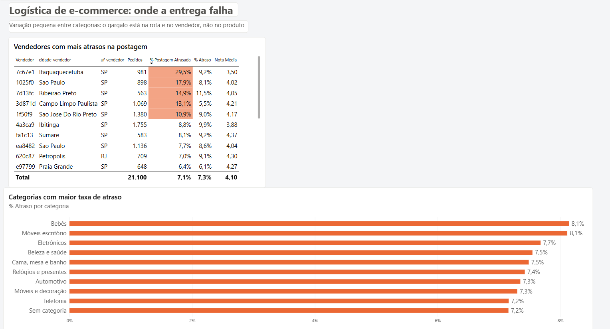
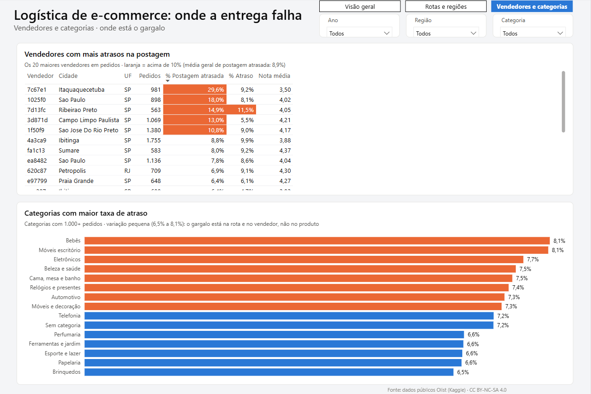
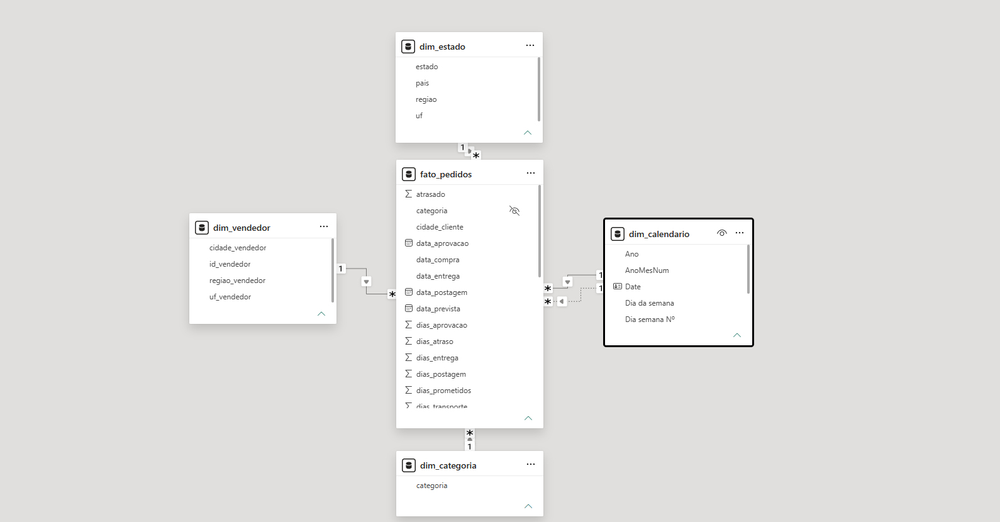

# Logística de e-commerce: onde a entrega falha

Dashboard em Power BI que analisa **96 mil pedidos reais** de um marketplace brasileiro (Olist, jan/2017 a ago/2018) para responder a uma pergunta que sempre me intrigou na operação logística: **quando a entrega atrasa, de quem é a culpa?**

O projeto foi feito **duas vezes**: primeiro manualmente, clique a clique, e depois com auxílio de IA (Claude Code), para comparar as duas abordagens.



## Principais resultados

- **6,8%** dos pedidos entregues chegaram atrasados. Com atraso, a nota média do cliente cai de **4,29 para 2,27**, e as avaliações ruins (nota 1 ou 2) sobem de 9% para 62%.
- O **transporte** responde por **74%** do prazo total; a postagem do vendedor, por 22%.
- Quando o vendedor posta fora do prazo, a chance de atraso na entrega sobe de **5,4% para 21,1%**.
- Alagoas (21,5%) e Maranhão (17,5%) lideram os atrasos; São Paulo fica em 4,5%.
- Pedidos acima de 2.000 km levam **21 dias** e atrasam 12,1% das vezes; até 100 km, 6,5 dias e 4,5%.
- A Black Friday de 2017 e o período de fev–mar/2018 estouraram a operação, com picos de até 19% de atraso.
- A taxa de atraso varia pouco entre categorias de produto (6,5% a 8,1%): o gargalo está na rota e no vendedor, não no produto.

**Recomendações:** cobrar o prazo de postagem dos vendedores, ajustar a promessa de entrega por rota e reforçar a capacidade antes das datas sazonais.

## Manual x com IA

| | Versão manual | Versão com IA (Claude Code) |
| --- | --- | --- |
| Tempo | cerca de 2 dias | 20 a 30 minutos |
| Modelo e medidas DAX | criados um a um | gerados junto com o arquivo |
| Revisão | — | alguns dados subiram errados e geraram divergência nos gráficos; identifiquei e corrigi |

**Conclusão:** a IA acelera muito o processo, principalmente a parte de carregar os dados com o modelo e as medidas. Mas ainda precisa de supervisão de quem entende a ferramenta: sem saber o que pedir e como validar o resultado, os erros passariam despercebidos. Fazer a versão manual primeiro foi o que me deu essa base.

| Versão manual | Versão com IA |
| --- | --- |
|  |  |
|  |  |
|  |  |

## Como foi feito

1. **Tratamento em Python (pandas)**, em `scripts/build.py`
   - Junção de 6 tabelas da base original, consolidando um registro por pedido
   - Cálculo das etapas do lead time: aprovação, postagem e transporte
   - Distância entre vendedor e cliente a partir do CEP (fórmula de Haversine)
   - Flag de postagem fora do prazo-limite do vendedor e tradução das categorias
2. **Modelagem em estrela**: 1 tabela fato e 4 dimensões, com calendário em DAX e um relacionamento inativo para análise por data de entrega

   

3. **29 medidas em DAX** ([ver todas](medidas_dax.md)): taxa de atraso, prazos, tempo por etapa, avaliações, frete, comparação mês a mês e cor condicional por meta
4. **Relatório de 3 páginas**: Visão geral, Rotas e regiões, Vendedores e categorias

## Estrutura do repositório

```
├── dashboard_manual.pbix            # versão feita manualmente no Power BI
├── dashboard_manual.pdf             # as 3 páginas da versão manual
├── versao_ia_claude_code.zip        # versão com IA, em formato de projeto (.pbip)
├── medidas_dax.md                   # as 29 medidas DAX da versão manual
├── scripts/build.py                 # tratamento dos dados em Python
├── scripts/gerar_pbip.py            # script que o Claude Code usou para gerar a versão com IA
├── tema_olist.json                  # tema de cores do Power BI
└── imagens/                         # prints das páginas e do modelo
```

A base tratada (`olist_logistica_powerbi.xlsx`, 22 MB) não está no repositório por causa do tamanho: ela é gerada pelo `build.py`.

## Como reproduzir

1. Baixe a base [Brazilian E-Commerce Public Dataset by Olist](https://www.kaggle.com/datasets/olistbr/brazilian-ecommerce) e coloque os CSVs na mesma pasta do `build.py`.
2. Rode `pip install pandas openpyxl` e depois `python build.py`. O script gera o `olist_logistica_powerbi.xlsx`.
3. Abra o `dashboard_manual.pbix` no Power BI Desktop e aponte a fonte de dados para o Excel gerado. Para a versão com IA, descompacte o `.zip`, abra o `.pbip` e ajuste o parâmetro `CaminhoExcel`.

## Ferramentas

Python (pandas, NumPy) · Power BI Desktop · Power Query · DAX · Claude Code

## Próximo passo

Com a mesma base, estou construindo um modelo de Machine Learning para prever a demanda.

---

Dados: Olist, licença CC BY-NC-SA 4.0. Projeto de portfólio de Rafael Simões.
